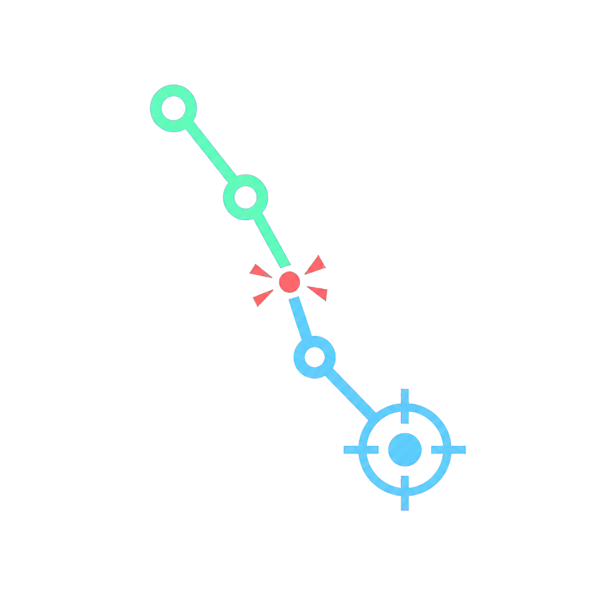
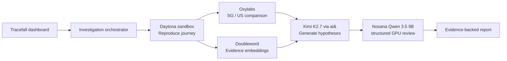

<div align="center">
  
  <h1>Tracefall</h1>
  <p><strong>An autonomous incident investigator for broken customer journeys.</strong></p>
  <p>Reproduce the failure. Challenge the evidence. Report the best-supported cause.</p>
</div>

## Why Tracefall

A checkout failure usually leaves evidence scattered across browser logs, DOM state, network traces, regions, and previous incidents. Engineers spend the first critical minutes assembling that evidence before they can reason about the cause.

Tracefall turns that investigation into one observable feedback loop. The hackathon MVP investigates one controlled reference journey—product page → cart → checkout—and deliberately reproduces a regional payment SDK failure.

## MVP boundary: why the reference store is deliberate

The bundled store is not presented as a production customer. It is a controlled incident target that makes the full product loop reproducible for judges, automated agents, and local evaluators. The failure is seeded; the investigation path is functional.

This is an MVP because a user can trigger one complete, useful workflow and inspect its result:

1. a checkout journey reaches a deterministic failure;
2. Daytona executes an isolated reproduction;
3. Oxylabs compares the public target from Singapore and the United States;
4. Doubleword retrieves related evidence;
5. Kimi through ai& generates a structured diagnosis;
6. Nosana independently scores competing causes;
7. Tracefall returns an evidence-backed report with provider receipts.

The controlled target removes demo variance without hiding product boundaries. General journey recording, continuous scheduling, customer telemetry ingestion, and automatic remediation are roadmap features—not claims of this build.

## Agent quickstart: deterministic evaluation without secrets

### Prerequisites

- Node.js `20.18` or newer
- npm `10` or newer
- an unused local port `3000`

### Install and configure

```bash
git clone https://github.com/MT7654/tracefall.git
cd tracefall
npm install
```

Create `.env.local` from the safe template:

```bash
# macOS / Linux
cp .env.example .env.local

# Windows PowerShell
Copy-Item .env.example .env.local
```

Set this single value in `.env.local`:

```dotenv
TRACEFALL_MODE=demo
```

No external credentials are required for the deterministic path. All provider receipts will explicitly say `demo · fallback`; fixture data is never labeled as live.

### Verify and run

```bash
npm run typecheck
npm run build
npm run dev
```

Open these routes:

| Route | Expected behavior |
|---|---|
| `http://localhost:3000/` | Tracefall command center loads |
| `http://localhost:3000/investigate` | Starts the autonomous run and advances through the execution stages |
| `http://localhost:3000/report` | Displays the latest browser-session report, or a safe empty state |
| `http://localhost:3000/demo-store` | Reference storefront loads; checkout produces the seeded SDK error |
| `http://localhost:3000/api/journey-probe` | Returns JSON describing the public reference journey |

On `/`, click **Launch autonomous investigation**. The app routes to `/investigate`, completes the seven-stage execution trace, stores the result in browser session storage, and automatically routes to `/report`.

Expected diagnosis:

```text
Incident: Checkout journey failure
Failed step: Proceed to checkout
Likely cause: Third-party payment script failed to load
Scope: Reproduced from Singapore; healthy from the United States
Confidence: approximately 84%
```

Run the target journey separately at `http://localhost:3000/demo-store`.

### API-only evaluation

After starting the app, an agent can evaluate the orchestrator without browser automation:

```bash
curl -X POST http://localhost:3000/api/investigate
```

Minimum assertions:

- HTTP status is `200`;
- `incident` is `Checkout journey failure`;
- `failedStep` is `Proceed to checkout`;
- `likelyCause` mentions the payment script;
- `providers` contains exactly five receipts;
- each receipt exposes `provider`, `mode`, `status`, `durationMs`, and `detail`;
- `mode` is `demo` for the no-secret evaluation.

## Capability integration map

These systems were selected because the investigation needs five different capabilities: isolated execution, regional web access, semantic retrieval, primary reasoning, and independent verification.

| Product | Meaningful role | Source | Visible proof |
|---|---|---|---|
| **Daytona** | Creates an isolated TypeScript sandbox, executes the reproduction, and returns structured evidence | `lib/integrations.ts → runDaytona()` | Sandbox ID, duration, live/demo receipt |
| **Oxylabs** | Fetches the controlled public journey probe through Singapore and US Residential Proxy exits | `lib/integrations.ts → runOxylabs()` | Regional HTTP status, latency, SDK state |
| **Doubleword** | Embeds five evidence records using Qwen3-Embedding-8B and ranks them with cosine similarity | `lib/integrations.ts → runDoubleword()` | Ranked historical evidence and model receipt |
| **Kimi AI via ai&** | Generates structured hypotheses, summary, confidence, and recommended action | `lib/integrations.ts → runAiAnd()` | ai& completion ID and generated diagnosis |
| **Nosana** | Verifies the supplied Qwen GPU deployment and scores three competing causes in one bounded structured review | `lib/integrations.ts → runNosana()` | Deployment ID, GPU hypothesis scores |

This is intentionally a feedback loop rather than an API parade: Daytona reproduces → retrieval and regional probes enrich evidence → ai& proposes the diagnosis → Nosana challenges competing causes → the report exposes receipts for every system.

## Architecture



The Next.js server route is the ordinary application orchestrator; no opaque multi-agent framework is used. Each adapter returns the same receipt shape: provider, execution mode, status, duration, external ID, and human-readable detail.

## Execution modes

- `demo`: no network calls; deterministic evidence for agents, judges, and offline review.
- `hybrid` (default): attempt every live sponsor, preserve successful results, and fall back independently when one service is unavailable.
- `live`: reserved for a fully credentialed deployment. The report still refuses to claim certainty.

Fallback is deliberately per-provider. A slow GPU deployment must not erase a successful Daytona reproduction or break the visual demo.

### Evaluator decision table

| Available configuration | Recommended mode | What is being evaluated |
|---|---|---|
| No credentials | `demo` | Complete UX, orchestration contract, deterministic evidence and report |
| Some credentials | `hybrid` | Live configured adapters plus explicit independent fallbacks |
| All credentials and a warm Nosana endpoint | `hybrid` | End-to-end live execution; result reports `mode: live` only if every receipt succeeds |

`TRACEFALL_MODE=live` is not required. The orchestrator derives the final report mode from the actual receipts rather than trusting a label.

## Environment

Copy `.env.example` to `.env.local`. Never commit `.env.local`.

```dotenv
TRACEFALL_MODE=hybrid

DAYTONA_API_KEY=
DAYTONA_API_URL=https://app.daytona.io/api
DAYTONA_TARGET=us

OXYLABS_USERNAME=
OXYLABS_PASSWORD=

DOUBLEWORD_API_KEY=
DOUBLEWORD_BASE_URL=https://api.doubleword.ai/v1
DOUBLEWORD_CHAT_MODEL=Qwen/Qwen3.5-35B-A3B-FP8
DOUBLEWORD_EMBEDDING_MODEL=Qwen/Qwen3-Embedding-8B

AIAND_API_KEY=
AIAND_BASE_URL=https://api.aiand.com/v1
AIAND_MODEL=moonshotai/kimi-k2.7-code

NOSANA_API_KEY=
NOSANA_DEPLOYMENT_ID=
NOSANA_MODEL=qwen3.5:9b
NOSANA_INFERENCE_URL=

NEXT_PUBLIC_APP_URL=http://localhost:3000
```

Oxylabs cannot reach localhost. After deploying, set `NEXT_PUBLIC_APP_URL` to the public Vercel URL and redeploy. The local hybrid run uses the official Oxylabs sandbox target until a public URL is present.

## Commands

| Command | Purpose |
|---|---|
| `npm run dev` | Start the application |
| `npm run typecheck` | Strict TypeScript verification |
| `npm run build` | Production build |
| `npm run verify` | Typecheck and build |
| `npm run check:integrations` | Credentialed provider smoke tests using `.env.local` |

Run a single credentialed smoke test by passing the provider name:

```bash
npm run check:integrations -- nosana
npm run check:integrations -- daytona
```

The integration checker is intentionally separate from deterministic evaluation. It performs real network calls and may consume provider credits.

## Repository map

```text
app/
  page.tsx                  Product landing page and workflow preview
  investigate/page.tsx      Auto-running agent workflow
  report/page.tsx           Session-backed incident report
  demo-store/page.tsx       Deterministically broken checkout target
  api/investigate/route.ts  Workflow entrypoint
  api/journey-probe/route.ts Public regional probe
lib/
  orchestrator.ts           Sponsor sequencing and fallback policy
  integrations.ts           Five real service adapters
  demo-data.ts              Deterministic evidence fixtures
  types.ts                  Shared report and receipt contracts
public/brand/               Generated Tracefall logo assets
components/                 Shared 3D and report views
EVALUATION.md               Machine-oriented review steps
ARCHITECTURE.md             Detailed decisions and limitations
```

## What is real and what is constrained

The Daytona sandbox call, Oxylabs proxy requests, Doubleword embeddings, ai& completion, and Nosana deployment lookup/inference are real when credentials and endpoints respond. The broken store, prior incidents, screenshots, and fallback hypothesis outputs are synthetic fixtures created specifically for a reliable two-minute hackathon demo.

This MVP does not claim continuous monitoring, general journey authoring, automatic fixes, authentication, alerting, or definitive root cause. It reports a best-supported likely cause.

## Common evaluator issues

- **The investigation waits on missing providers:** confirm `TRACEFALL_MODE=demo` for a no-secret run.
- **Oxylabs cannot reach localhost:** expected; use the deployed URL through `NEXT_PUBLIC_APP_URL` for live proxy checks.
- **Nosana returns 503:** the Ollama deployment may still be downloading or warming. Demo and hybrid modes remain evaluable.
- **A provider reports fallback:** inspect its `detail` field. Fallbacks are explicit and scoped to that adapter.
- **Port 3000 is occupied:** run `npm run dev -- -p 3001` and use the corresponding local URL.
- **Build and runtime are being conflated:** `npm run typecheck` validates TypeScript, `npm run build` validates the production bundle, and the POST endpoint validates orchestration behavior.

## Security

- Secrets are server-only and ignored by Git.
- The browser never receives provider credentials.
- Daytona sandboxes are labeled and deleted after execution.
- Provider calls use bounded timeouts.
- Error receipts intentionally avoid returning secret values.

## Hackathon judging alignment

- **Completeness:** functional target journey, isolated investigation, regional evidence, AI challenge loop, final report.
- **Innovation:** independent hypothesis generation and decentralized challenge, followed by evidence convergence.
- **Real-world fit:** reduces the high-cost first-response phase of customer-journey incidents.
- **Platform usage:** every external system has an inspectable adapter, a necessary investigation capability, and an on-screen execution receipt.

Built for Daytona HackSprint Singapore 2026.
