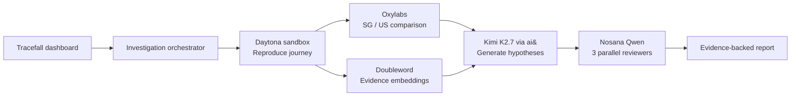

<div align="center">
  
  <h1>Tracefall</h1>
  <p><strong>An autonomous incident investigator for broken customer journeys.</strong></p>
  <p>Reproduce the failure. Challenge the evidence. Report the best-supported cause.</p>
</div>

## Why Tracefall

A checkout failure usually leaves evidence scattered across browser logs, DOM state, network traces, regions, and previous incidents. Engineers spend the first critical minutes assembling that evidence before they can reason about the cause.

Tracefall turns that investigation into one observable feedback loop. The hackathon MVP monitors one predefined journey—product page → cart → checkout—and deliberately fails when a regional payment SDK is unavailable.

## Five-minute evaluation

```bash
npm install
copy .env.example .env.local  # Windows; use cp on macOS/Linux
npm run dev
```

Visit `http://localhost:3000`, click **Investigate checkout**, and watch the seven-stage execution trace. With no secrets, set `TRACEFALL_MODE=demo`; the deterministic incident remains completely evaluable.

Expected diagnosis:

```text
Incident: Checkout journey failure
Failed step: Proceed to checkout
Likely cause: Third-party payment script failed to load
Scope: Reproduced from Singapore; healthy from the United States
Confidence: approximately 84%
```

Run the target journey separately at `http://localhost:3000/demo-store`.

## Sponsor integration map

| Product | Meaningful role | Source | Visible proof |
|---|---|---|---|
| **Daytona** | Creates an isolated TypeScript sandbox, executes the reproduction, and returns structured evidence | `lib/integrations.ts → runDaytona()` | Sandbox ID, duration, live/demo receipt |
| **Oxylabs** | Fetches the public journey probe through Singapore and US Residential Proxy exits | `lib/integrations.ts → runOxylabs()` | Regional HTTP status, latency, SDK state |
| **Doubleword** | Embeds five evidence records using Qwen3-Embedding-8B and ranks them with cosine similarity | `lib/integrations.ts → runDoubleword()` | Ranked historical evidence and model receipt |
| **Kimi AI via ai&** | Generates structured hypotheses, summary, confidence, and recommended action | `lib/integrations.ts → runAiAnd()` | ai& completion ID and generated diagnosis |
| **Nosana** | Verifies the supplied Qwen GPU deployment and evaluates three competing causes concurrently | `lib/integrations.ts → runNosana()` | Deployment ID, parallel hypothesis scores |

This is intentionally a feedback loop rather than an API parade: Daytona reproduces → retrieval and regional probes enrich evidence → ai& proposes causes → Nosana challenges them → the report exposes receipts for every system.

## Architecture



The Next.js server route is the ordinary application orchestrator; no opaque multi-agent framework is used. Each adapter returns the same receipt shape: provider, execution mode, status, duration, external ID, and human-readable detail.

## Execution modes

- `demo`: no network calls; deterministic evidence for agents, judges, and offline review.
- `hybrid` (default): attempt every live sponsor, preserve successful results, and fall back independently when one service is unavailable.
- `live`: reserved for a fully credentialed deployment. The report still refuses to claim certainty.

Fallback is deliberately per-provider. A slow GPU deployment must not erase a successful Daytona reproduction or break the visual demo.

## Environment

Copy `.env.example` to `.env.local`. Never commit `.env.local`.

```dotenv
TRACEFALL_MODE=hybrid

DAYTONA_API_KEY=
DAYTONA_API_URL=https://app.daytona.io/api
DAYTONA_TARGET=us

OXYLABS_USERNAME=
OXYLABS_PASSWORD=

DOUBLEWORD_API_KEY=
DOUBLEWORD_BASE_URL=https://api.doubleword.ai/v1
DOUBLEWORD_CHAT_MODEL=Qwen/Qwen3.5-35B-A3B-FP8
DOUBLEWORD_EMBEDDING_MODEL=Qwen/Qwen3-Embedding-8B

AIAND_API_KEY=
AIAND_BASE_URL=https://api.aiand.com/v1
AIAND_MODEL=moonshotai/kimi-k2.7-code

NOSANA_API_KEY=
NOSANA_DEPLOYMENT_ID=
NOSANA_MODEL=qwen3.6:27b
NOSANA_INFERENCE_URL=

NEXT_PUBLIC_APP_URL=http://localhost:3000
```

Oxylabs cannot reach localhost. After deploying, set `NEXT_PUBLIC_APP_URL` to the public Vercel URL and redeploy. The local hybrid run uses the official Oxylabs sandbox target until a public URL is present.

## Commands

| Command | Purpose |
|---|---|
| `npm run dev` | Start the application |
| `npm run typecheck` | Strict TypeScript verification |
| `npm run build` | Production build |
| `npm run verify` | Typecheck and build |

## Repository map

```text
app/
  page.tsx                  Product dashboard and incident report
  demo-store/page.tsx       Deterministically broken checkout target
  api/investigate/route.ts  Workflow entrypoint
  api/journey-probe/route.ts Public regional probe
lib/
  orchestrator.ts           Sponsor sequencing and fallback policy
  integrations.ts           Five real service adapters
  demo-data.ts              Deterministic evidence fixtures
  types.ts                  Shared report and receipt contracts
public/brand/               Generated Tracefall logo assets
EVALUATION.md               Machine-oriented review steps
ARCHITECTURE.md             Detailed decisions and limitations
```

## What is real and what is constrained

The Daytona sandbox call, Oxylabs proxy requests, Doubleword embeddings, ai& completion, and Nosana deployment lookup/inference are real when credentials and endpoints respond. The broken store, prior incidents, screenshots, and fallback hypothesis outputs are synthetic fixtures created specifically for a reliable two-minute hackathon demo.

This MVP does not claim continuous monitoring, general journey authoring, automatic fixes, authentication, alerting, or definitive root cause. It reports a best-supported likely cause.

## Security

- Secrets are server-only and ignored by Git.
- The browser never receives provider credentials.
- Daytona sandboxes are labeled and deleted after execution.
- Provider calls use bounded timeouts.
- Error receipts intentionally avoid returning secret values.

## Hackathon judging alignment

- **Completeness:** functional target journey, isolated investigation, regional evidence, AI challenge loop, final report.
- **Innovation:** independent hypothesis generation and decentralized challenge, followed by evidence convergence.
- **Real-world fit:** reduces the high-cost first-response phase of customer-journey incidents.
- **Sponsor usage:** every sponsor has an inspectable adapter, a data responsibility, and an on-screen execution receipt.

Built for Daytona HackSprint Singapore 2026.
